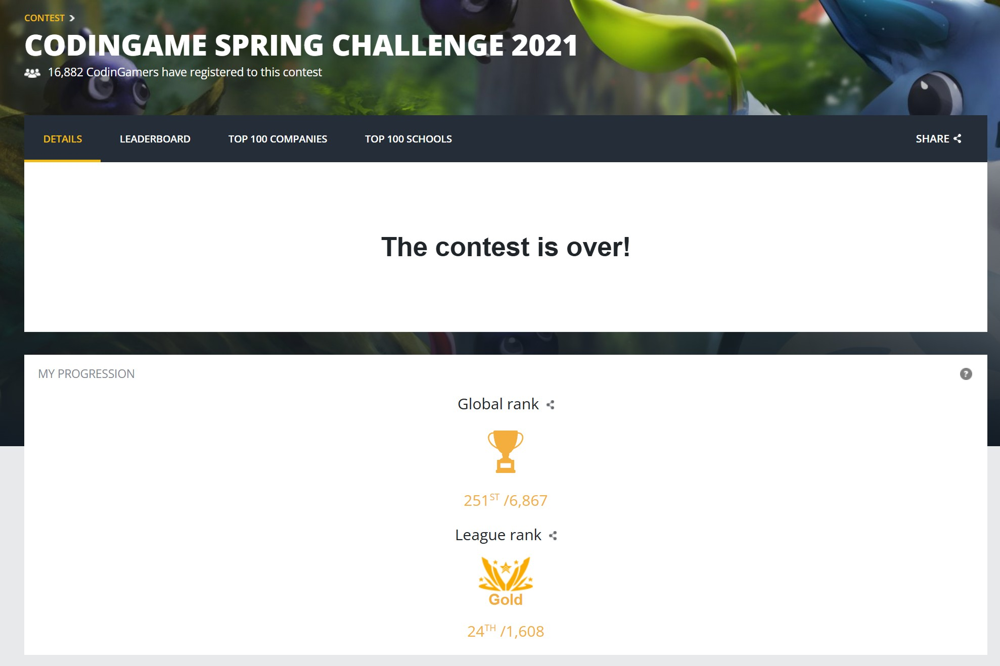

### CodinGame Spring Challenge 2021

- Final rank: **Top 4%** (251st of 6,867)
- Language: Typescript (transpiled to JS)

It was a great competition, many thanks to the admins and everyone involved in organising it.



### General Strategy

Unlike most people who were using trees, neural networks and such I have used a hierarchical utility based approach.

### Managing Game State

There is a very good article from redblobgames about hexagonal grids that helped me to understand how to work with an axial coordinate system so I ended up using matrixes, coordinates, vectors and dictionaries that mapped between cell indexes and coordinates for faster performance.

### Utility functions

There are lot of great pieces about the topic, but the gist of it is that you have something called a `utility function` and after you pass in a set of variables (in my case the entire game state) you get back a normalized value between 0 and 1 that is a representation of how valuable/desireable the action is.

**So the order for a utility function is:**

- Clone the current state
- Apply the action (e.g. SEED 7) to the cloned state
- Calculate a normalized utility between 0 and 1 of the modified state for each utility function
- Average the results

**Example for grow:**

```
const clonedGameState = cloneGameState(oldGameState);
const newGameState = applyActionToGameState(clonedGameState, playerAction);
const utility = average([
	calculateRelativeSunProducedForHalfCycleUtility(newGameState),
	calculateRelativeSunProducedForFullCycleUtility(newGameState),
	calculateStopGrowingTreesAtTheEndUtility(newGameState),
]);
```

**Example for seed:**

```
const clonedGameState = cloneGameState(oldGameState);
const newGameState = applyActionToGameState(clonedGameState, playerAction);
const utility = average([
	caluclatePreventSeedingTooEarlyUtility(newGameState),
	caluclatePreventSeedingAtTheEndOfGameUtility(newGameState),
	calculateMapCellsControlledUtility(newGameState),
	calculateAvoidCramnessUtility(newGameState),
	calculateAvoidSpammingSeedsUtility(newGameState),
	calculateAvoidCastingShadowsOnOwnTreesUtility(newGameState),
	calculateSeedAreasWithRichSoilUtility(newGameState)
]);
```

### Hierarchical utility

As you can see the above examples are action specific, so in order to make this work I grouped together the actions to action-sets at each tick.

```
[WAIT, COMPLETE X, COMPLETE Y...]
[WAIT, GROW X, GROW Y...]
[WAIT, SEED X, SEED Y...]
[WAIT]
```

- Check if completing a tree or waiting is better
- If completing a tree is better than waiting do the action (exit)
- If not move on to the next action set
- Check if growing a tree or waiting is better
- If growing a tree is better than waiting do the action (exit)
- If not move on to the next action set
- Check if seeding or waiting is better
- If seeding is better than waiting do the action (exit)
- If not then wait (exit)

### Accounting for opponent actions

I did account for the locations and shadows being cast by the opponent's trees, but did not account for the potential moves the opponent could make in a certain game state. I simply applied my action and calculated the utility.

### What I liked / did not like about the approach

- Quick prototyping and relatively good results quickly
- Enabling/disabling small utility functions made it easy to discard functions that weren't affecting the game much (or at all)
- Sometimes it was difficult to wrap my head around the fact that a utility function was evaluating the state without the knowledge of which action changed the state (e.g. a utility function for grow didn't know which tree was grown). Maybe shouldn't have done it this way, but I wanted to stick to my choice

Thanks again, looking forward to the fall challenge. :)
